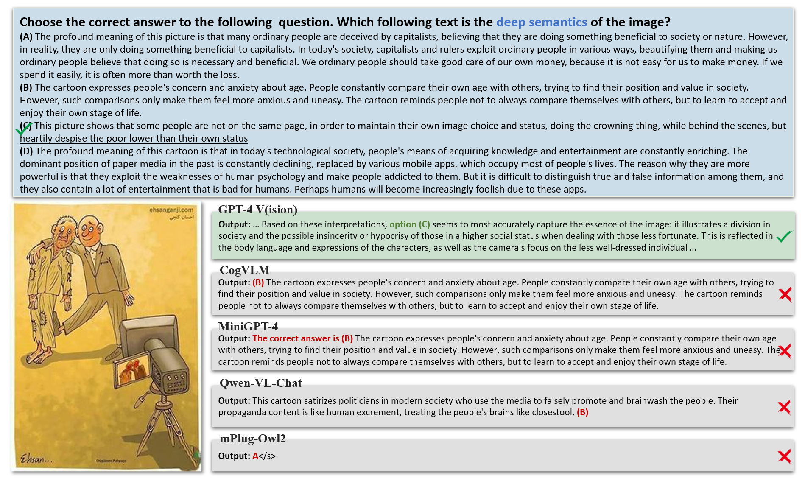

# DeepEval
DeepEval is a comprehensive benchmark to assess Large Multimodal Models’ capacities of **visual deep semantics**. Our benchmark includes human-annotated dataset and three progressive subtasks: Fine-grained Description Selection, In-depth Title Matching, and Deep Semantics Understanding, to comprehensively evaluate models’ capabilities in understanding deep semantics. By undertaking DeepEval, our goal is to promote research in model development, focusing on a deeper understanding of semantics in visual content.

[[Link to paper]](https://arxiv.org/abs/2402.11281) [[Blogpost]]() 



## Dataset

The dataset is stored as [four JSON file](https://github.com/AnnaYang2020/DeepEval/tree/main/data).

The annotation part: [Annotation.json](https://github.com/AnnaYang2020/DeepEval/blob/main/data/Annotation.json).

Each example has the following fields:

- **Image_ID**: a unique ID for each image
- **Url**: the url of the image
- **Options**: the options of the multiple-choice question, including option A, B, C and D
- **Answer**: the golden answer for the multiple-choice question
- **Prompt_{num}**: the {num}-th prompt format of the multiple-choice question

The question part: [DeepSemantics_Questions.json](https://github.com/AnnaYang2020/DeepEval/blob/main/data/DeepSemantics_Questions.json), [Descripion_Questions.json](https://github.com/AnnaYang2020/DeepEval/blob/main/data/Descripion_Questions.json), and [Title_Questions.json](https://github.com/AnnaYang2020/DeepEval/blob/main/data/Title_Questions.json).

Each example has the following fields:

- **Image_ID**: a unique ID for each image
- **Url**: the url of the image
- **Description**: the manully annotated description of the image
- **Title**: the manully annotated title of the image
- **Deep_Semantics**: the manully annotated deep semantics of the image


## Running the evaluation

To run the evaluation, you need to first download the evaluated models and configure their environments.
use [test_{model_name}.py](https://github.com/.../.../tree/main/tests) and [evaluate.py](https://github.com/.../.../tree/main/tests/evaluate.py) as follows:

```bash
python test_{model_name}.py --model-path {model_path} --save-path {save_path}
python evaluate.py --result-path {save_path}
```

## Leaderboard 🏆
DeepEval Score (%)
| Model           | Backbone         | # Params       | Description     | Title     | DeepSemantics     |
|-----------------|---------------------|--------|--------|--------|--------|
| CogVLM  | Vicuna-v1.5               | 17B  | 72.83  | 45.05  | 32.20  |
| InstructBlip-13B          | Vicuna-v1.5               | 14B  | 59.44  | 36.66  | 15.75  |
| LLaVA-1.5-13B       | Vicuna-v1.5               | 13B | 53.91  | 35.13  | 25.71  |
| Qwen-VL-Chat     | Qwen               | 10B  | 78.82  | 47.68  | 28.30  |
| mPlug-Owl2      | LLaMA2               | 8B  | 75.26  | 47.75  | 31.37  |
| MiniGPT-4   | LLaMA2               | 8B  | 41.79  | 33.00  | 26.34  |
| InstructBlip-7B    | Vicuna-v1.5               | 8B  | 49.88  | 32.23  | 15.72  |
| Fuyu   | -               | 8B  | 29.90  | 26.54  | 17.44  |
| LLaVA-1.5-7B       | Vicuna-v1.5               | 7B  | 48.62  | 32.00  | 24.94  |
| GPT-4V         | -               | -  | 96.53  | 55.01  | 63.14  |
| Human         | -               | -  | 100.00  | 94.00  | 93.00  |


## Citation

```bibtex
@article{yang2024can,
  title={Can Large Multimodal Models Uncover Deep Semantics Behind Images?},
  author={Yang, Yixin and Li, Zheng and Dong, Qingxiu and Xia, Heming and Sui, Zhifang},
  journal={arXiv preprint arXiv:2402.11281},
  year={2024}
}
```
